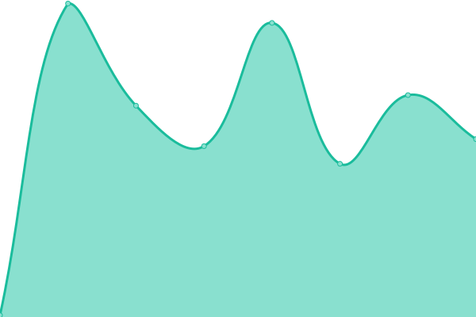
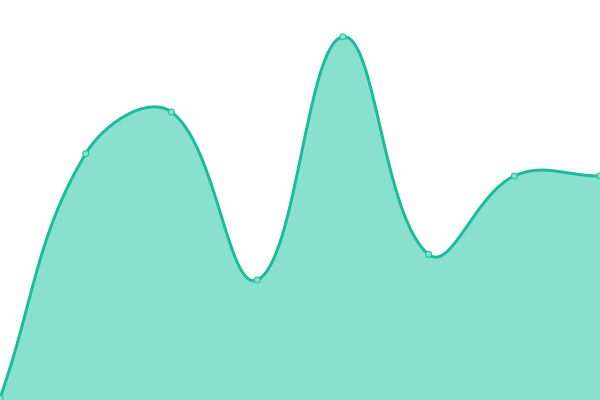
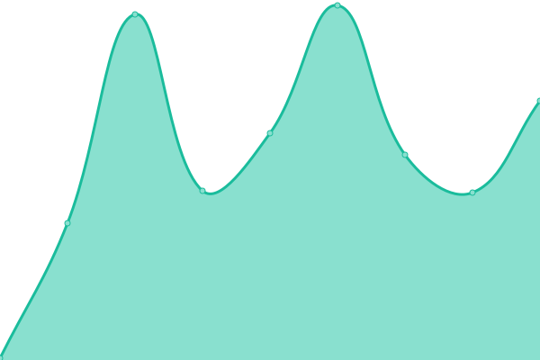

# [📈 Live Status](https://unforest.github.io/uptime): <!--live status--> **🟧 Partial outage**

This repository contains the open-source uptime monitor and status page for [unforest](https://unforest.github.io/uptime), powered by [Upptime](https://github.com/upptime/upptime).

With [Upptime](https://upptime.js.org), you can get your own unlimited and free uptime monitor and status page, powered entirely by a GitHub repository. We use [Issues](https://github.com/unforest/uptime/issues) as incident reports, [Actions](https://github.com/unforest/uptime/actions) as uptime monitors, and [Pages](https://unforest.github.io/uptime) for the status page.

<!--start: status pages-->
<!-- This summary is generated by Upptime (https://github.com/upptime/upptime) -->
<!-- Do not edit this manually, your changes will be overwritten -->
<!-- prettier-ignore -->
| URL | Status | History | Response Time | Uptime |
| --- | ------ | ------- | ------------- | ------ |
|  [Unforest](https://www.unforest.net) | 🟥 Down | [unforest.yml](https://github.com/unforest/uptime/commits/HEAD/history/unforest.yml) | 

 289ms
     
 | 

<a href="https://unforest.github.io/uptime/history/unforest">63.43%</a>
    

|  [Piped](https://piped.unforest.net) | 🟥 Down | [piped.yml](https://github.com/unforest/uptime/commits/HEAD/history/piped.yml) | 

 329ms
     
 | 

<a href="https://unforest.github.io/uptime/history/piped">65.29%</a>
    

|  [Piped API](https://pipedapi.unforest.net) | 🟥 Down | [piped-api.yml](https://github.com/unforest/uptime/commits/HEAD/history/piped-api.yml) | 

 269ms
     
 | 

<a href="https://unforest.github.io/uptime/history/piped-api">61.46%</a>
    

|  [SearXNG](https://searxng.unforest.net) | 🟥 Down | [sear-xng.yml](https://github.com/unforest/uptime/commits/HEAD/history/sear-xng.yml) | 

 232ms
     
 | 

<a href="https://unforest.github.io/uptime/history/sear-xng">63.48%</a>
    

|  [Libreddit](https://libreddit.unforest.net) | 🟥 Down | [libreddit.yml](https://github.com/unforest/uptime/commits/HEAD/history/libreddit.yml) | 

 249ms
     
 | 

<a href="https://unforest.github.io/uptime/history/libreddit">65.43%</a>
    

|  [Nitter](https://nitter.unforest.net) | 🟩 Up | [nitter.yml](https://github.com/unforest/uptime/commits/HEAD/history/nitter.yml) | 

 186ms
     
 | 

<a href="https://unforest.github.io/uptime/history/nitter">62.96%</a>
    

|  [Rimgo](https://rimgo.unforest.net) | 🟥 Down | [rimgo.yml](https://github.com/unforest/uptime/commits/HEAD/history/rimgo.yml) | 

 233ms
     
 | 

<a href="https://unforest.github.io/uptime/history/rimgo">60.83%</a>
    

<!--end: status pages-->

[**Visit our status website →**](https://unforest.github.io/uptime)

## 📄 License

- Powered by: [Upptime](https://github.com/upptime/upptime)
- Code: [MIT](./LICENSE) © [unforest](https://unforest.github.io/uptime)
- Data in the `./history` directory: [Open Database License](https://opendatacommons.org/licenses/odbl/1-0/)
